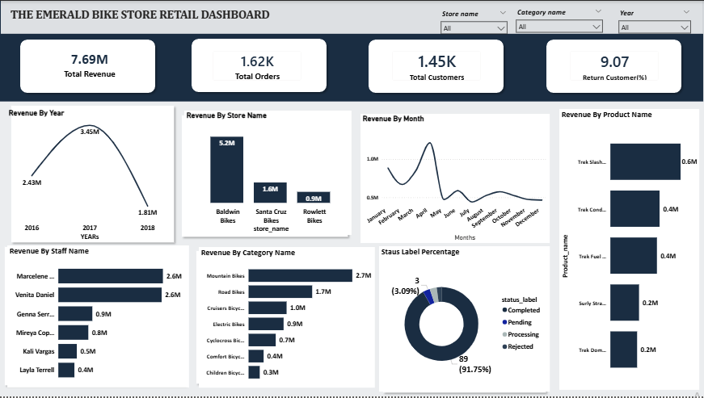

# <h1>The Emerald BikeStores Retail Analytics</h1>
<h4>A multi-table SQL data analysis project exploring sales performance, staff productivity, customer behaviour, and inventory health across a 3-store bicycle retail chain.</h4>

<h3>Bike Store Dashboard</h3>

<h3>Bike Store ERD DIAGRAM</h3>

<h3>Problem Statement</h3> 
<h4>BikeStores Inc. is a multi-store bicycle retail chain that has been recording sales, customer, product, and employee data across separate systems since 2016. </h4>
<h4>The data was migrated into a central SQL database but contained quality issues — including NULL values, inconsistent formats, orphaned references, and data type mismatches — that made reliable reporting impossible.</h4>
<h4>The operations and sales leadership teams needed clear answers to key business questions: Which stores and staff drive the most revenue? </h4>
<h4>Which products are underperforming? Who are the most valuable customers? Are there seasonal sales patterns?</h4>
<h4>This project audits the database, resolves data quality issues, and produces analytical insights to support strategic decisions on inventory, staffing, and customer retention.</h4>

<h2>Tools Used</h2>
<h4>SQL Server (SSMS):Data storage, querying, and analysis</h4>
<h4>Power BI: Dashboard and data visualisation</h4>
<h4>GitHub:Version control and portfolio hosting</h4>
<h4>dbdiagram.ioEntity Relationship Diagram (ERD)</h4>
