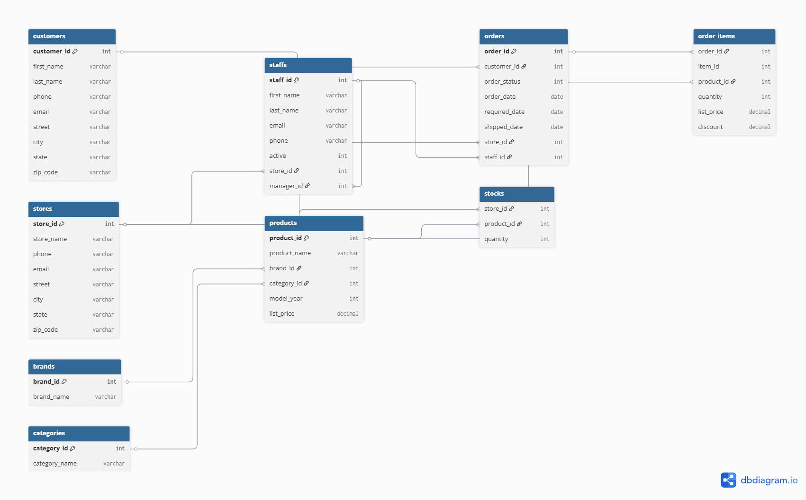

# <h1>The Emerald BikeStores Retail Analytics</h1>
<h4>A multi-table SQL data analysis project exploring sales performance, staff productivity, customer behaviour, and inventory health across a 3-store bicycle retail chain.</h4>

<h3>Bike Store Dashboard</h3>

<h3>Bike Store ERD DIAGRAM</h3>

<h3>Problem Statement</h3> 
<h4>BikeStores Inc. is a multi-store bicycle retail chain that has been recording sales, customer, product, and employee data across separate systems since 2016. </h4>
<h4>The data was migrated into a central SQL database but contained quality issues — including NULL values, inconsistent formats, orphaned references, and data type mismatches — that made reliable reporting impossible.</h4>
<h4>The operations and sales leadership teams needed clear answers to key business questions: Which stores and staff drive the most revenue? </h4>
<h4>Which products are underperforming? Who are the most valuable customers? Are there seasonal sales patterns?</h4>
<h4>This project audits the database, resolves data quality issues, and produces analytical insights to support strategic decisions on inventory, staffing, and customer retention.</h4>

<h2>Tools Used</h2>
<h4>SQL Server (SSMS):Data storage, querying, and analysis</h4>
<h4>Power BI: Dashboard and data visualisation</h4>
<h4>GitHub:Version control and portfolio hosting</h4>
<h4>dbdiagram.ioEntity Relationship Diagram (ERD)</h4>

<h2>KEY FINDINGS</h2>
<h3>REPEAT CUSTOMERS:</h3>
<h4>Only 9.07% of the total number of customers have placed more than one orders in the 3 years of business.
Possible indication is that the remaining 91% of customers are not satisfied with the service rendered, or could be as a result of poor customer service or high price of goods and other variables.
The business should encourage customers feedback and perform surveys to understand why it has poor customer retention.
They should also develop retention and win-back policies like sales and discounts to drive customer win-back and retention. 
A 5% improvement in retention rate would bring repeat buyers from 131 to approximately 203 customers — a 55% increase in returning customers.</h4>

<h3>DAYS BETWEEN REPURCHASE:</h3>
<h4>The analysis shows that returning customers spend an average of 380 days between their first and second order. 
In other words, on average customers spend over a year before placing any orders. 
While this may indicate that our products are of good quality and long lasting, it may also indicate poor customer satisfaction. 
This assumption is based on the fact that revenue dropped by 47.53% by 2018.
Customer feedbacks and surveys would go a long way in understanding their customers preferences. It will shed more light customers satisfaction. Also the business should lean more into promotions and marketing to gain new followers. With occasional discounts, sales and holiday price slashes, we could gain new customers and increase revenue.</h4>

<h3>REVENUE ANALYSIS BY YEAR:</h3>
<h4>The reports show a 47.54% decrease in revenue from the year 2017 to 2018. 
Possible indication is that sales declined as a result of fewer new customers and even fewer returning customers as seen by percentage of returning customers is at 9.07. 
The Business should lean heavily into promotions, marketing and advertisement. The Launch of Win-back campaigns, price sales and slashes during holiday periods will go along way in attracting new customers. 
The use of targeted campaigns based on age grade will be an asset.</h4>
